# Contribute to this Guide

This documentation website is designed to allow for input from readers and contributing to it is a fairly straightforward process.

GitHub, the website on which this documentation is built, is built using Git, a version control system that tracks file changes over time and allows multiple users to make alterations to files and present them to the owners of those files for review and acceptance or rejection. In the case of this guide, any suggested alterations will be sent to the Kora Documentation team for consideration prior to being officially added to this documentation website.

To contribute, you will need to [sign up for a GitHub account](https://github.com/join). (If using an educational email address, you may also considering [signing up for a GitHub Education account](https://education.github.com/), which will give you access to a number of useful tools.) Once you have completed the process for creating an account – including verifying your email address via the link that will be emailed to you – you will be able to make changes to this documentation and submit it for review.

The kinds of contributions that readers can make fall into two broad categories. The first would be any changes related to grammar, syntax, very minor page layout changes (such as splitting one paragraph into two), or other small-scale copy-edits. The second would be suggestions to include any new reference images or data files, entirely new guide entries, or significant rewrites of existing guide entries.

## Copy-Editing and Other Minor Changes

When making minor changes to pages in this documentation website, please keep the changes for each page within its own pull request. To add additional edits to the same page, when the pull request has already been created, pleas see the sub-section, "[Additional Edits to the Same Page](#additional-edits-to-the-same-page)" below.

Pull requests will remain
### First-Time Page Edit

1. To make minor changes to any page in this guide, click "Edit on GitHub" in the top-right of the page to be edited. Do this for each separate page to be edited.

    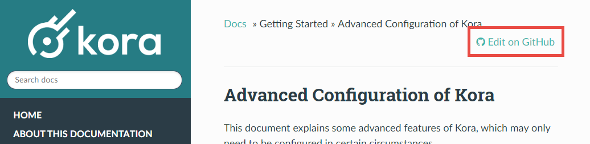

    This will take you to GitHub's website. If not logged in, you will be asked to do so. Once (or if) logged in, you will be directed to a notification that you will need to "fork" the kora-documentation repository before you can make edit suggestions.

    !!! note
        In Git nomenclature, "fork" is both a noun and a verb: a fork is a copy of another account's repository and to that copy is to fork it; you have control over your fork, and the version control system tracks the differences between your repository, the repository from which you forked, and any other forks that are traced back to the original repository. Your fork is identical to the repository from which you forked it only until either you change your fork, or the originating repository is changed by someone.

2. The page notifying you of the need to fork looks like the screenshot below. Click on "Fork this repository":

    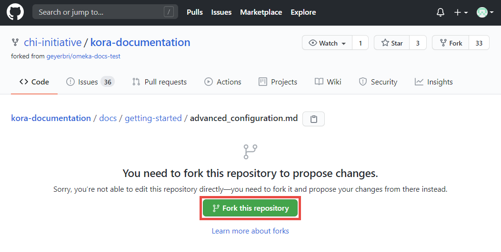

3. The page that loads will be the Markdown code for the page you are intending to edit. GitHub will again provide a notification at the top of this page, that you are editing a fork of the kora-documentation repository, rather than the original one managed by the chi-initiative GitHub account. This notification also notifies you that, when you save any changes you make in this code, the system will create a new "branch," from which you can send a "pull request" to the main kora-documentation repository for review by the documentation team. These words are highlighted below.

    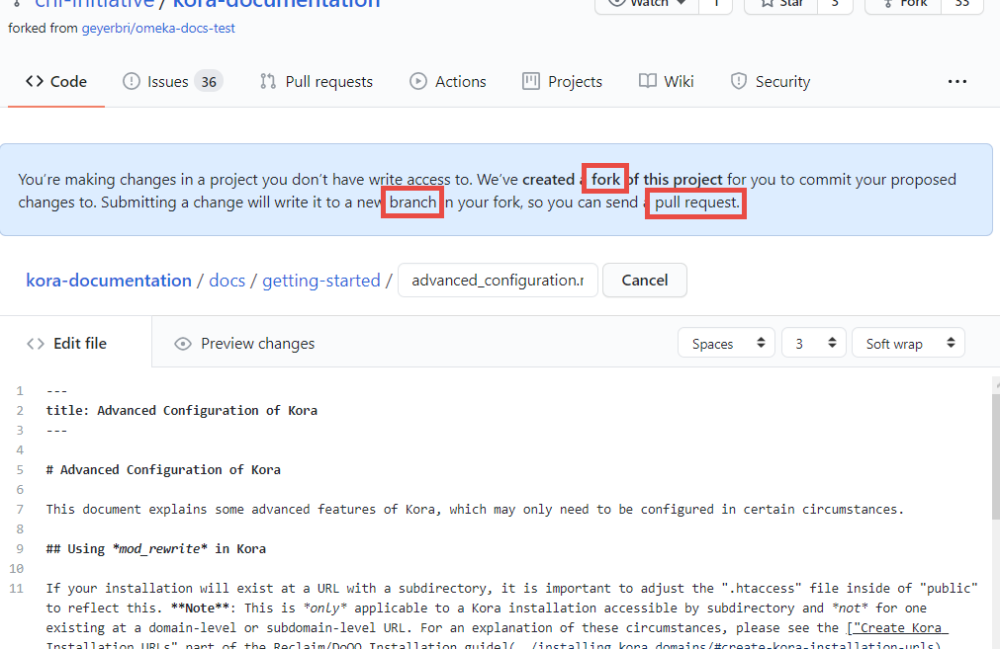

    !!! note
        Within a repository, there is at least one "branch," or version, of the repository code. Many repositories have multiple branches, which the owners use to keep track of different versions of their projects. In the case of your newly-forked repository, the system will be creating a new branch each time you click on "Edit on GitHub," make some changes, and save those changes in your repository.

4. In the GitHub page that has opened, find the parts of the page you wish to edit and make your changes. The Kora Documentation pages are written in a plain-text syntax system called "Markdown," which is meant for use on the internet. Many find it intuitive to use. To learn how to use Markdown syntax to style your edits appropriately, please consult [this Markdown style guide](https://www.markdownguide.org/basic-syntax/).

    One acceptable addition to a page that you might find useful would an admonition, also called a call-out, to highlight a key explanation of some concept or idea. These look like this:

    !!! note
        This is an info admonition.

    !!! tip
        This is a tip admonition.

    !!! caution
        This is a caution admonition.

    !!! warning
        This is a warning admonition.

    To insert an admonition, follow this code example:

        !!! [admonition type]
            This is the descriptive paragraph for the admonition

    To change the admonition's default title, add the new title in quotations next to the admonition type:

        !!! [admonition type] "[Example Title]"
            Descriptive paragraph.

5. Once you have made your edits using Markdown syntax, scroll to the bottom of the page, to the "Propose changes" section.

6. In the first text box, give a short summary description of your proposed changes (this is basically a "title" for your proposed changes). In the second, larger box, describe your changes in more detail. These boxes are important to your proposed changes because an either too-long or too-vague summary (the first box) may lead to a documentation team member rejecting your suggestions, since they may not understand your summary correctly. The detailed explanation, though less important, can still serve as a great way to expound upon your summary, so that any vagueness can be better summarized, but without adding to the "title."

    Once you have filled in at least the first box (and hopefully the second), click on "Propose changes" to complete the editing for this page.

    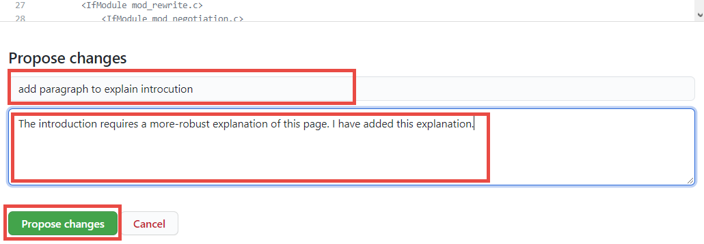

7. GitHub will then take you to a page to create a "pull request" containing your pages, from the newly-created branch in your forked repository and leading to the main kora-documentation repository.

    !!! note
        In Git (and GitHub) nomenclature, a "pull request" is a request to bring content TO a particular branch FROM another particular branch. As long as the branches are within the same system of connected repositories, then anyone who has one of those repositories can make a pull request for content from one branch to another (even two forked repositories). Though anyone can create the pull request, only the owner of the repository where the content is going TO can accept the request.

    Highlighted below is, from left-to-right, the repository where the changes are going TO (owned by chi-initiative), the branch of that repository it is going TO (master), the arrow indicating the direction of the change, then the repository it is coming FROM (your own repository, or in the case of the example, one owned by the bsgeyer account), and then the branch of the repository it is coming FROM (the newly-created "patch-1" branch).

    Click on the green "Create pull request" button.

    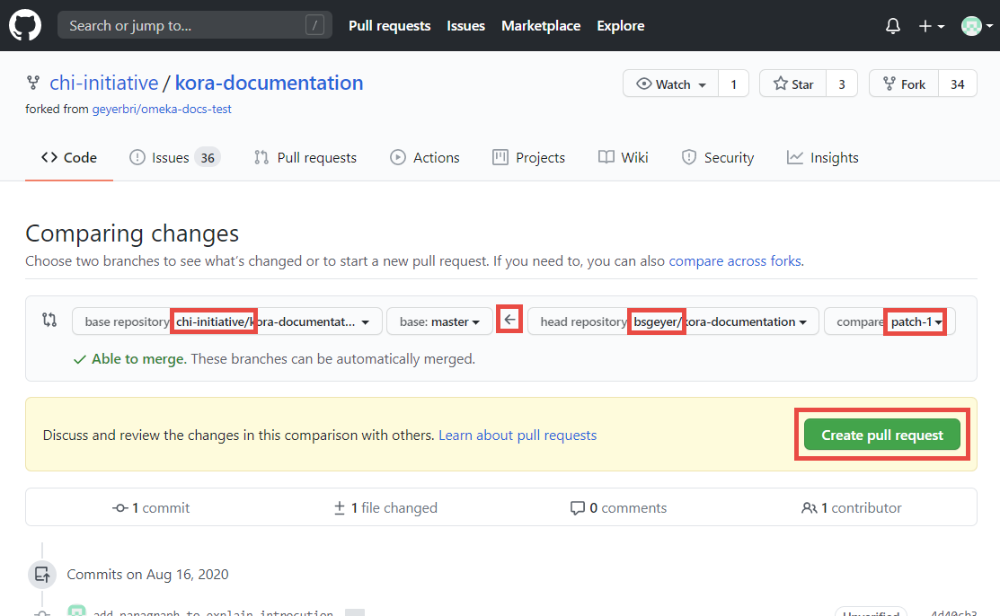

8. Clicking on this button will again change the view on the page, putting the short summary you wrote before into the pull request title box, and the longer description from before into the pull request description. If you wish to change either of these (such as to fix typos, like the ones in the example screenshots presented here), feel free to do so.

    Click on the new, green "Create pull request" button that appears below these boxes to finalize the pull request.

    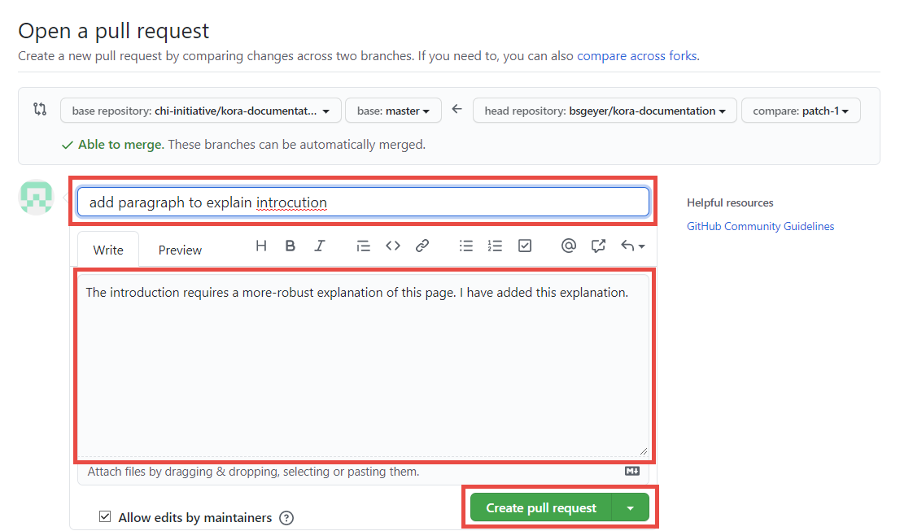

    This will officially create the pull request in the main kora-documentation repository, for the documentation team to review. If all has been done correctly, it will look similar to this:

    

### Additional Edits to the Same Page

1. If, after creating a pull request, you decide you wish to make further edits to the *same* page, you will need to find your [pull request in the chi-initiative-owned kora-documentation repository](https://github.com/chi-initiative/kora-documentation/pulls).

    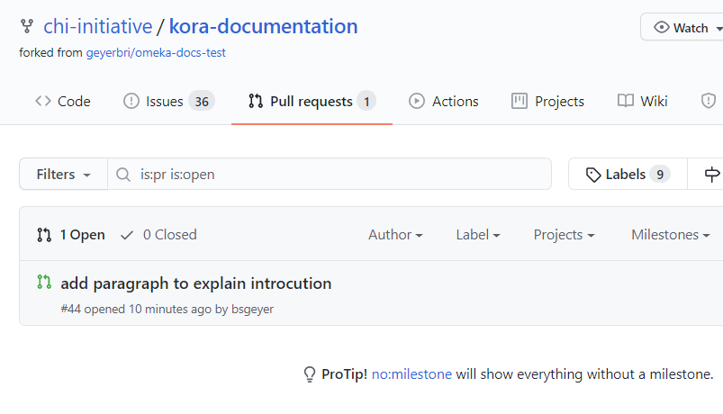

    When viewing the list of pull requests, you can filter them by author, and select your own account from the list. GitHub puts the user's account at the top of such dropdown lists, for ease of use.

    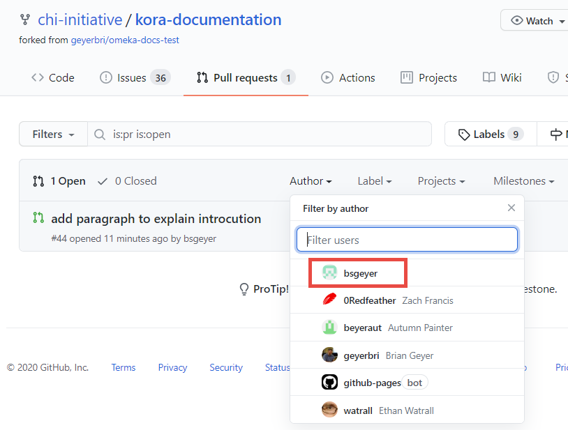

2. Once you find your pull request and click on it, its page will open. Click on the "Files changed" tab.

    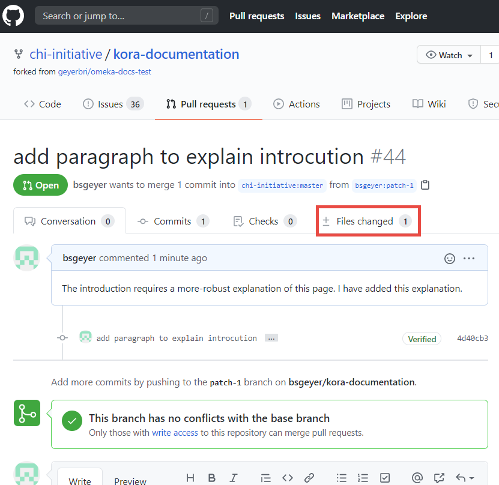

    The view will change to show a summary of the edits you previously made for this page's file. To reopen this file and add more edits, click on the three-dot menu icon, then select "Edit file" to be directed to the file's edit page.

    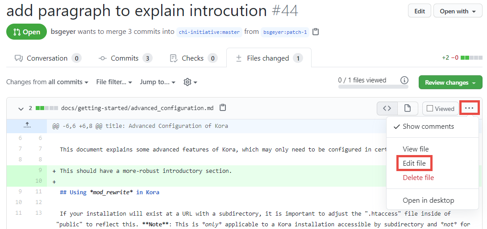

3. Make any desired additional changes. Once finished, scroll down to the bottom of the page, to write a summary and description for this "commit." Be sure to leave the default option, to "Commit directly to the `patch-1` branch," which will add your changes to your already-opened pull request.

    Click the green "Commit changes" button to finish adding it.

    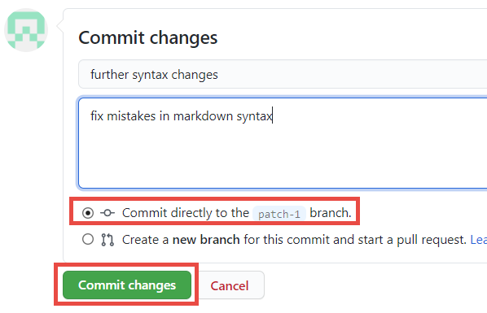

    !!! note
        In Git (and GitHub) nomenclature, a "commit" is the smallest version of change tracked in the system.

Doing this will add one's changes to the already-existing pull request for this page.

## Major Edit or New File Proposals

In cases where you would like to suggest new documentation pages, images, or data files, you will need to submit these requests via GitHub's "Issues" feature. To open a new Issue for the kora-documentation, visit the repository's Issue's page](https://github.com/chi-initiative/kora-documentation/issues).

On this page, click the green "New issue" button on the right-hand side of the page.

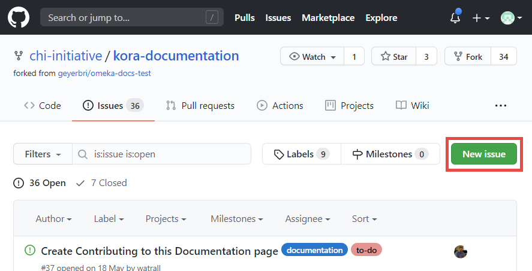

This will open a list of templates to use for proposing your changes.

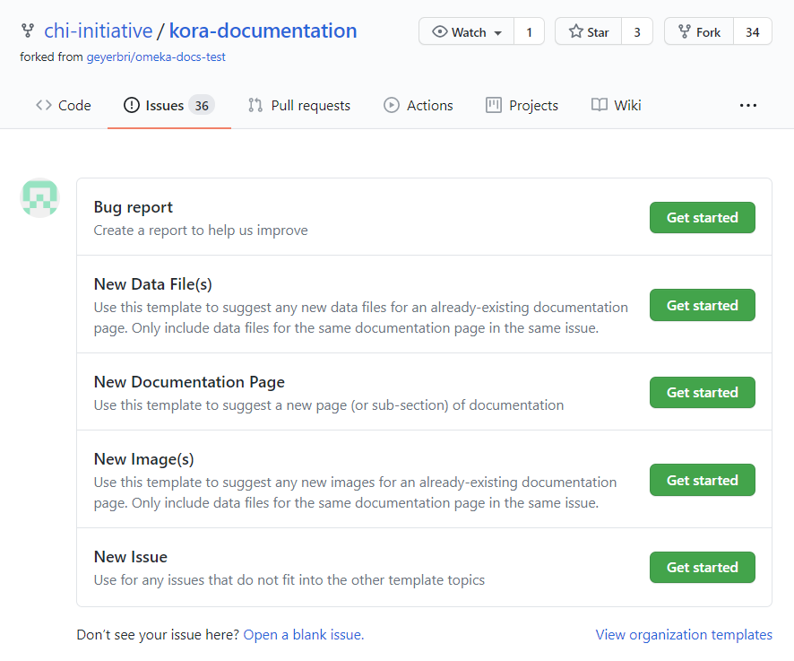

Select the template that corresponds to the changes you would like to suggest by clicking the green "Get started" button next to it, and fill in the requested information. When complete, click the green "Submit new issue" button at the bottom.

!!! tip
    When suggesting a new page, write your page's code using the following template:

        # [Page Title]

        introductory text

        ## [First Page Section Title]

        section text

        ## [Second Page Section Title]

        section text
